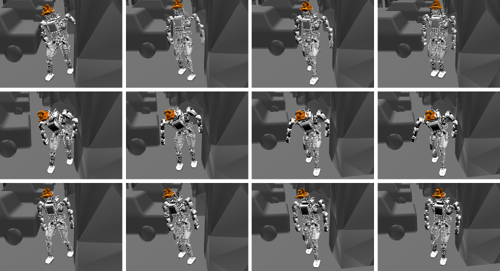

# LegOpt Benchmark



This repository is for the LegOpt Benchmark (**Legged-robot posture and trajectory Optimization Benchmark**).

LegOpt is a benchmark for evaluating different algorithms at the tasks of **posture generation** and **trajectory optimization** on legged robots.
There are **50 problems for each task**, which are associated with a pre-defined robot model, scenario, constraints and cost functions.

The scenario is from the [Destruction Scenarios Dataset](http://www.roboptics.pt/index.php/destruction-scenarios/).

In this repository we provide:

1. latest benchmark results
2. problem definition data
3. solution evaluation scripts
4. usage and submission instructions

---

## Paper

If you use this in your research, please cite:

> Martim Brandao, Kenji Hashimoto, and Atsuo Takanishi, "**SGD for robot motion? The effectiveness of stochastic optimization on a new benchmark for biped locomotion tasks**", in *17th IEEE-RAS International Conference on Humanoid Robots*, 2017.

Make sure to check the paper for details [(PDF here)](http://www.martimbrandao.com/papers/Brandao2017-humanoids.pdf).

---

## Latest benchmark results

<table>
<tr style="font-weight:bold"><td colspan=3></td><td colspan=3 align=center>Posture generation</td><td colspan=3 align=center>Trajectory optimization</td></tr>
<tr style="font-weight:bold"><td>Method</td><td>Multi starts </td><td>Sample size</td><td>Success rate</td><td>Cost</td><td>Time (s)</td><td>Success rate</td><td>Cost</td><td>Time (s)</td></tr>
<tr> <td>SQP     </td> <td> 0 </td> <td>100</td> <td>49/50</td> <td> 426.68</td> <td>   1.32</td> <td>19/50</td> <td>   0.13</td> <td>   0.63</td> </tr>
<tr> <td>SGD     </td> <td> 0 </td> <td>100</td> <td>44/50</td> <td> 719.83</td> <td>   3.76</td> <td>4 /50</td> <td>   0.20</td> <td>   1.38</td> </tr>
<tr> <td>Adam    </td> <td> 0 </td> <td>100</td> <td>42/50</td> <td> 606.38</td> <td>   4.15</td> <td>18/50</td> <td>   0.14</td> <td>   1.22</td> </tr>
<tr> <td>Nadam   </td> <td> 0 </td> <td>100</td> <td>39/50</td> <td> 590.26</td> <td>   2.83</td> <td>16/50</td> <td>   0.14</td> <td>   0.81</td> </tr>
<tr> <td>SQP     </td> <td>10 </td> <td>100</td> <td>50/50</td> <td> 426.64</td> <td>   1.44</td> <td>42/50</td> <td>   0.13</td> <td>   0.62</td> </tr>
<tr> <td>SGD     </td> <td>10 </td> <td>100</td> <td>49/50</td> <td> 797.55</td> <td>   6.30</td> <td>27/50</td> <td>   0.17</td> <td>   2.17</td> </tr>
<tr> <td>Adam    </td> <td>10 </td> <td>100</td> <td>49/50</td> <td> 642.92</td> <td>   5.97</td> <td>31/50</td> <td>   0.14</td> <td>   1.50</td> </tr>
<tr> <td>Nadam   </td> <td>10 </td> <td>100</td> <td>49/50</td> <td> 641.97</td> <td>   5.67</td> <td>35/50</td> <td>   0.15</td> <td>   1.19</td> </tr>
<tr> <td>SQP     </td> <td>10 </td> <td> 80</td> <td>16/50</td> <td> 297.75</td> <td>   2.74</td> <td>0 /50</td> <td>   0.00</td> <td>   0.00</td> </tr>
<tr> <td>SGD     </td> <td>10 </td> <td> 80</td> <td>50/50</td> <td> 788.22</td> <td>   5.82</td> <td>26/50</td> <td>   0.16</td> <td>   1.99</td> </tr>
<tr> <td>Adam    </td> <td>10 </td> <td> 80</td> <td>50/50</td> <td> 628.55</td> <td>   4.18</td> <td>35/50</td> <td>   0.14</td> <td>   2.05</td> </tr>
<tr> <td>Nadam   </td> <td>10 </td> <td> 80</td> <td>50/50</td> <td> 619.66</td> <td>   2.90</td> <td>33/50</td> <td>   0.14</td> <td>   1.10</td> </tr>
<tr> <td>I-SQP   </td> <td>10 </td> <td> 80</td> <td>50/50</td> <td> 460.58</td> <td>   1.00</td> <td>42/50</td> <td>   0.13</td> <td>   0.53</td> </tr>
<tr> <td>I-SGD   </td> <td>10 </td> <td> 40</td> <td>49/50</td> <td> 833.01</td> <td>   4.13</td> <td>30/50</td> <td>   0.15</td> <td>   1.30</td> </tr>
<tr> <td>I-Adam  </td> <td>10 </td> <td> 40</td> <td>50/50</td> <td> 660.53</td> <td>   3.27</td> <td>40/50</td> <td>   0.14</td> <td>   1.07</td> </tr>
<tr> <td>I-Nadam </td> <td>10 </td> <td> 40</td> <td>50/50</td> <td> 666.94</td> <td>   2.66</td> <td>41/50</td> <td>   0.15</td> <td>   0.73</td> </tr>
</table>

Note: costs and times are averaged over successfully solved problems.

---

## Latest benchmark results (from "tough" initialization in collision)

<table>
<tr style="font-weight:bold"><td colspan=3></td><td colspan=3 align=center>Posture generation</td><td colspan=3 align=center>Trajectory optimization</td></tr>
<tr style="font-weight:bold"><td>Method</td><td>Multi starts </td><td>Sample size</td><td>Success rate</td><td>Cost</td><td>Time (s)</td><td>Success rate</td><td>Cost</td><td>Time (s)</td></tr>
<tr> <td>SQP     </td> <td> 0 </td> <td>100</td> <td>43/50</td> <td> 415.62</td> <td>   1.43</td> <td>11/50</td> <td>   0.12</td> <td>   0.67</td> </tr>
<tr> <td>SGD     </td> <td> 0 </td> <td>100</td> <td>41/50</td> <td> 769.82</td> <td>   3.55</td> <td>2 /50</td> <td>   0.18</td> <td>   1.26</td> </tr>
<tr> <td>Adam    </td> <td> 0 </td> <td>100</td> <td>46/50</td> <td> 616.37</td> <td>   3.78</td> <td>2 /50</td> <td>   0.14</td> <td>   1.27</td> </tr>
<tr> <td>Nadam   </td> <td> 0 </td> <td>100</td> <td>48/50</td> <td> 645.27</td> <td>   2.33</td> <td>1 /50</td> <td>   0.11</td> <td>   0.92</td> </tr>
<tr> <td>SQP     </td> <td>10 </td> <td>100</td> <td>50/50</td> <td> 429.45</td> <td>   1.74</td> <td>29/50</td> <td>   0.12</td> <td>   0.84</td> </tr>
<tr> <td>SGD     </td> <td>10 </td> <td>100</td> <td>48/50</td> <td> 783.34</td> <td>   5.11</td> <td>29/50</td> <td>   0.16</td> <td>   3.04</td> </tr>
<tr> <td>Adam    </td> <td>10 </td> <td>100</td> <td>50/50</td> <td> 671.93</td> <td>   4.30</td> <td>32/50</td> <td>   0.15</td> <td>   2.10</td> </tr>
<tr> <td>Nadam   </td> <td>10 </td> <td>100</td> <td>50/50</td> <td> 678.50</td> <td>   3.20</td> <td>30/50</td> <td>   0.15</td> <td>   1.96</td> </tr>
<tr> <td>SQP     </td> <td>10 </td> <td> 80</td> <td>20/50</td> <td> 278.90</td> <td>   4.00</td> <td>0 /50</td> <td>   0.00</td> <td>   0.00</td> </tr>
<tr> <td>SGD     </td> <td>10 </td> <td> 80</td> <td>49/50</td> <td> 774.82</td> <td>   4.44</td> <td>30/50</td> <td>   0.16</td> <td>   2.49</td> </tr>
<tr> <td>Adam    </td> <td>10 </td> <td> 80</td> <td>50/50</td> <td> 642.19</td> <td>   3.91</td> <td>36/50</td> <td>   0.15</td> <td>   2.12</td> </tr>
<tr> <td>Nadam   </td> <td>10 </td> <td> 80</td> <td>50/50</td> <td> 637.78</td> <td>   2.70</td> <td>34/50</td> <td>   0.14</td> <td>   1.47</td> </tr>
<tr> <td>I-SQP   </td> <td>10 </td> <td> 80</td> <td>50/50</td> <td> 468.25</td> <td>   1.34</td> <td>38/50</td> <td>   0.14</td> <td>   0.71</td> </tr>
<tr> <td>I-SGD   </td> <td>10 </td> <td> 40</td> <td>49/50</td> <td> 809.90</td> <td>   5.17</td> <td>30/50</td> <td>   0.15</td> <td>   1.40</td> </tr>
<tr> <td>I-Adam  </td> <td>10 </td> <td> 40</td> <td>50/50</td> <td> 668.34</td> <td>   3.66</td> <td>34/50</td> <td>   0.15</td> <td>   1.34</td> </tr>
<tr> <td>I-Nadam </td> <td>10 </td> <td> 40</td> <td>50/50</td> <td> 684.47</td> <td>   3.44</td> <td>28/50</td> <td>   0.14</td> <td>   1.64</td> </tr>
</table>

Note: costs and times are averaged over successfully solved problems.

---

## Data format

### JSON data for problems

Problems for each task are defined on **JSON** files. Please have a look inside folder *data*.

Maybe more intuitive than writing the schema here is to show how you would access the information in C++ or python. So here it is:

```python
jsonroot["robot"]                         # name of the robot model used (this is always "atlas" for now)
jsonroot["scenario"]                      # name of the Destruction Scenario used (this is always "garage_easier" for now)
jsonroot["task"]                          # either "posture" or "motion", for posture generation or trajectory optimization respectively
jsonroot["problems"][p]                   # problem number p
jsonroot["problems"][p]["id"]             # the id of problem number p
jsonroot["problems"][p]["definition"]     # the definition of problem number p
jsonroot["problems"][p]["definition"][d]  # a string representing stance number d of problem number p
```

The format for strings representing stances is the following:

```
"<name-of-link-in-contact>,<space-separated-quaternion-xyzw> <space-separated-translation-xyz>,<name-of-link-in-contact>,<space-separated-quaternion-xyzw>,"
```

It assumes a rotation and translation from the world reference frame.

Example 1 (only the left foot is in contact):

```
"l_foot,-0.4896072729 -0.1111596603 -0.0645970827 -0.8624125841 -12.53751087 0.6949124932 5.57654953 ,"
```

Example 2 (both feet in contact):

```
"l_foot,-0.4896072729 -0.1111596603 -0.0645970827 -0.8624125841 -12.53751087 0.6949124932 5.57654953 ,r_foot,-0.4893193662 -0.1129687271 -0.06397458697 -0.8623873125 -12.60409355 1.338053823 5.595780373 ,"
```

### JSON data for solutions

In order to evaluate your solutions with the scripts we provide, you should add them to a **JSON** file in the following way.

You should start from the respective problems JSON and add a "solution" object to each problem that you solve.

```python
jsonroot["problems"][p]["solution"]                 # holds your solutions for problem number p
```

You can solve each problem with several methods, so "solution" is a list where each item contains the solution vector, the name of the method used and the computation time.

```python
jsonroot["problems"][p]["solution"][s]["method"]    # name of the method used to obtain solution s
jsonroot["problems"][p]["solution"][s]["timeSec"]   # computation time (in seconds) to obtain solution s
jsonroot["problems"][p]["solution"][s]["x"][f]      # a string representing the full-body configuration number f of the solution
```

The format for strings representing a full-body configuration are "\n"-separated values of the DOFs (joints followed by translation and then quaternion).
Basically, what you would obtain in C++ with `operator<<` on a `Eigen::VectorXd`.

```
"<joint1value>\n<joint2value>\n(...)<jointNvalue>\n<x>\n<y>\n<z>\n<qx>\n<qy>\n<qz>\n<qw>"
```

Example:

```
"0.0750938\n-0.0115883\n0.0618958\n0.174954\n-1.39626\n3.05126\n0.365756\n-0.442819\n-0.0552547\n-0.610865\n0.13954\n0.169922\n1.39626\n3.07882\n-0.31723\n-0.0876133\n-0.072731\n-0.201933\n0.0678042\n-0.0458344\n0.750349\n-0.783705\n0.208692\n-0.211367\n-0.0466808\n-0.786813\n0.742743\n-0.0395884\n0.324678\n-12.55\n0.949195\n6.42098\n0.448645\n0.00514189\n-0.0392512\n0.997566"
```

---

## Usage and submission instructions

### Clone this repository

Clone this repository using

```
git clone --recursive https://github.com/martimbrandao/legopt-benchmark.git
```

### Dependencies

The list of dependencies is:

- Python 2.7
- numpy
- scipy
- JSON
- OpenRAVE (we tested on commit 0a05f794a5901885a25ed5cbd6e70eb3f37e0edd)

If you don't have them yet do:

```
sudo apt-get install python python-numpy python-scipy
```

Clone, build and install [OpenRAVE](https://github.com/rdiankov/openrave).
You can follow [these](https://scaron.info/teaching/installing-openrave-on-ubuntu-14.04.html) instructions if you are unsure how to do so.

### Downloading the additional data

If you just want the problem definition data, then the JSON files are already inside the *data* folder.
However, if you would like to compare the performance of your algorithms using the same problem initializations as I did, please use [these files](http://extra.martimbrandao.com/dl.php?id=124). The files are equivalent to the ones under the *data* folder, except for additional *x0* and *x0hard* variables on each problem (same format as the solution variable *x*).

If you would like to try and run the scripts on my solutions, you can download them from [here](http://extra.martimbrandao.com/dl.php?id=126), and place the contents (a folder called *solutions12-full-with-easy-and-hard-init*) inside *solutions/*.

### Evaluating your benchmark solutions

Run:

```
python LegOptEvalFast.py <path-to-solution-json-file> --verbose
```

You can also add a `--interactive` argument to visualize the solutions as they are checked in OpenRAVE.

If you would like to try and run the script with my solutions, see *Downloading the additional data* above.

### Adding your results to this page

Contact me and I will add your results here.

For normal evaluations you are not required to initialize your algorithms from the same staring point *x0* as provided in the additional data.
However, **if you want to evaluate your algorithm under tough initializations** then you should initialize your algorithms using the **x0hard** values provided in the additional data (see *Downloading the additional data* above).

